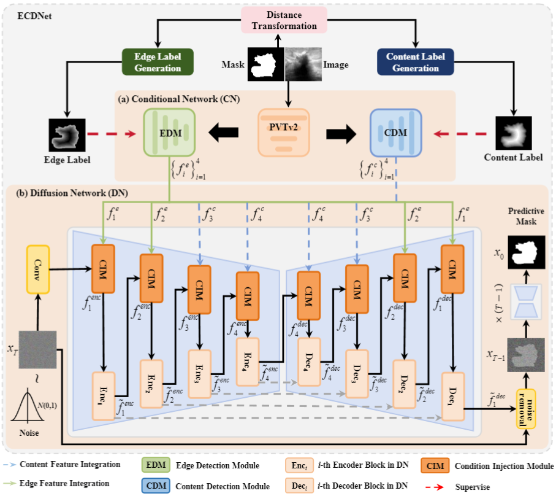

# ECDNet

Edge-Content Guided Diffusion Network for Breast Lesions Segmentation in Ultrasound Images



## 🔗 Dataset

download the dataset [BUSI](https://scholar.cu.edu.eg/?q=afahmy/pages/dataset) and [BUS-BRA](https://github.com/wgomezf/BUS-BRA)

## Experimental Environment

```
pip install -r requirements.txt
```

## Usage

### Training

```
python train.py 
```

### Testing

```
python test.py 
```
